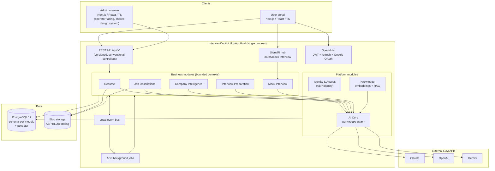

# Interview Copilot AI — Architecture Overview

Status: Draft for approval · Owner: Architecture · Last updated: 2026-06-11

## 1. System summary

Interview Copilot AI is a B2C SaaS platform that helps candidates prepare for interviews: it parses resumes, analyzes job descriptions, researches companies, generates questions / STAR answers / preparation plans, and runs AI-powered mock interviews with feedback and progress tracking.

The backend is a single deployable **ABP layered modular monolith** on **.NET 10 LTS** with **PostgreSQL 17 + pgvector**. Modules are isolated DDD bounded contexts that communicate only through application contracts and the in-process distributed event bus. AI access goes exclusively through an internal AI Core abstraction (`IAIProvider` strategy: Claude, OpenAI, Gemini).

## 2. Key architecture decisions

| # | Decision | Choice | Why (short) | ADR |
|---|----------|--------|-------------|-----|
| 1 | Deployment architecture | Modular monolith (ABP), single process, single DB | Team size, time to market, no premature distribution | [ADR-0001](../ADR/0001-modular-monolith.md) |
| 2 | Runtime / framework | .NET 10 LTS + ABP Framework 10.x (open source) | .NET 11 ships Nov 2026; ABP 10.x targets .NET 10; LTS support window | [ADR-0002](../ADR/0002-dotnet10-abp10.md) |
| 3 | Persistence | PostgreSQL, one database, schema-per-module, EF Core | Strong consistency inside modules, cheap ops, easy extraction later | [ADR-0001](../ADR/0001-modular-monolith.md) |
| 4 | Vector store | pgvector extension in the same PostgreSQL | One infra component, transactional ingestion, sufficient scale for years | [ADR-0003](../ADR/0003-pgvector.md) |
| 5 | AI access | `IAIProvider` strategy + router in AI Core module; business modules never reference LLM SDKs | Provider independence, central usage/cost tracking, testability | [ADR-0004](../ADR/0004-ai-provider-strategy.md) |
| 6 | Application layer style | Vertical slice feature folders + CQRS-lite (separate command/query app services, no MediatR) | ABP app services already give use-case granularity; avoid extra ceremony | [ADR-0005](../ADR/0005-vertical-slices-cqrs.md) |
| 7 | Tenancy | ABP multi-tenancy infrastructure ON, product runs B2C (host tenant only) | Free with ABP; keeps B2B (bootcamps, universities) open without retrofit | [ADR-0006](../ADR/0006-tenancy.md) |
| 8 | Internal communication | ABP local distributed event bus + ABP background jobs | Async decoupling without a broker; broker can be swapped in via ABP abstraction | [ADR-0001](../ADR/0001-modular-monolith.md) |
| 9 | Realtime | SignalR hub for mock-interview streaming (text now, voice later) | Native ASP.NET Core, token-by-token streaming UX | [ADR-0004](../ADR/0004-ai-provider-strategy.md) |
| 10 | AuthN/AuthZ | OpenIddict (bundled with ABP): auth code + PKCE for Next.js, JWT access + rotating refresh tokens, Google external login | Standard, no extra license, ABP-integrated permissions | [07-security.md](07-security.md) |

## 3. High-level architecture

Rules enforced by the dependency graph (and by ArchUnitNET tests, see [08-testing-strategy.md](08-testing-strategy.md)):

1. Business modules depend on other modules **only via `*.Application.Contracts`** (interfaces + DTOs) or events. Never on another module's Domain or EF Core project.
2. Only AI Core references LLM SDKs. Business modules consume `IAIChatCompletion` / `IAIEmbeddingService` abstractions.
3. Only the Knowledge module knows about pgvector and chunking.
4. The host project wires everything; modules never reference the host.

## 4. Primary flows

**Resume upload → profile** (async): `POST /api/v1/resumes` stores blob + `Resume` aggregate → publishes `ResumeVersionCreatedEto` → `ResumeParsingJob` calls AI Core (structured extraction) → writes skills/experiences → publishes `ResumeParsedEto` → Resume module updates `CareerProfile`; Knowledge module ingests chunks + embeddings (`EmbeddingGenerationJob`).

**JD analysis + skill gap** (async): `POST /api/v1/job-descriptions` → `JdAnalysisJob` extracts requirements → `JobDescriptionAnalyzedEto` → user requests skill-gap: compares `JobRequirement`s against `CareerProfile`, persists `SkillGapAnalysis`.

**Preparation plan** (async): `POST /api/v1/interview-plans/generate` (jdId, companyId, targetDate) → `PlanGenerationJob` uses JD requirements + skill gaps + company insights (RAG context from Knowledge) → `InterviewPlan` with scheduled `InterviewPlanItem`s. Dashboard progress is computed from item status + `StudyActivity` log.

**Mock interview** (sync + streaming): client opens SignalR connection → `StartSession` creates `InterviewSession` → AI interviewer streams questions token-by-token → each answer turn appended as `InterviewTurn` → `CompleteSession` → `MockSessionCompletedEto` → `FeedbackGenerationJob` writes `InterviewFeedback` (scores + rubric) → readiness snapshot updated.

All AI calls — sync or job-based — flow through AI Core, which resolves the prompt template, picks a provider via routing policy, records an `AIUsageLog` row (tokens, latency, cost, correlation id), and applies retry/fallback.

## 5. Non-functional requirements and how the design meets them

| NFR | Target (v1) | Mechanism |
|-----|-------------|-----------|
| Latency, interactive AI | First token < 2 s | Streaming providers, SignalR, no queue hop for mock interview |
| Latency, CRUD | p95 < 300 ms | EF Core compiled queries on hot reads, schema-local joins |
| Long AI work | Don't block requests > 5 s | Everything slow runs as a background job with status polling (`Pending/Processing/Completed/Failed`) |
| Scale | 10k MAU, ~50 concurrent mock sessions | Stateless host → horizontal scale-out; Postgres connection pooling; Redis backplane for SignalR when >1 node |
| Cost control | Per-user/feature AI metering | `AIUsageLog` + daily aggregates; quota checks via ABP features |
| Auditability | All writes attributable | ABP audit logging + `CreatorId/CreationTime` on every entity |
| Testability | Modules testable in isolation | Contracts-only coupling, fake `IAIProvider`, Testcontainers Postgres |
| Evolvability | Extract a module to a service without rewrite | Schema-per-module, contract-only references, event bus abstraction |

## 6. What we deliberately did NOT do

- **No microservices, no message broker, no API gateway** — one process, one DB. Revisit when a module needs independent scaling (most likely candidates: Mock Interview realtime, Knowledge embedding ingestion).
- **No MediatR / no event sourcing / no separate read DB** — CQRS is expressed as separate command/query application services; read models are EF projections.
- **No Semantic Kernel / LangChain dependency in business code** — AI Core's own thin abstraction keeps the surface we actually use small and testable. (We may use a provider SDK internally per implementation.)
- **No voice pipeline in v1** — session model and hub protocol are designed so an audio transport can be added as a new `SessionMode` without schema changes.

## 7. Revisit triggers

| Signal | Action |
|--------|--------|
| Embedding table > ~10M vectors or recall issues | Move Knowledge to dedicated vector DB (Qdrant) behind existing `IVectorStore` |
| Background job volume > ~10/s sustained | Swap ABP default job store for Hangfire/Quartz integration (ABP-supported) |
| >1 host node | Add Redis: SignalR backplane + distributed cache + distributed lock |
| B2B deals | Activate tenant resolution + tenant admin; data is already tenant-columned |
| A module's deploy cadence diverges hard | Extract that module: its schema, contracts, and events are already its seams |

## 8. Document map

| Doc | Contents |
|-----|----------|
| [01-solution-structure.md](01-solution-structure.md) | Solution/folder layout, project references |
| [02-bounded-contexts.md](02-bounded-contexts.md) | Context map, module responsibilities, published events |
| [03-domain-model.md](03-domain-model.md) | Aggregates, entities, value objects, invariants |
| [04-database-design.md](04-database-design.md) | ERD, tables, indexes, pgvector |
| [05-ai-architecture.md](05-ai-architecture.md) | IAIProvider, routing, prompts, RAG, usage tracking |
| [06-integration-and-jobs.md](06-integration-and-jobs.md) | Events, background jobs, SignalR protocol |
| [07-security.md](07-security.md) | OpenIddict, tokens, OAuth, permissions |
| [08-testing-strategy.md](08-testing-strategy.md) | Unit / module / integration test structure |
| [09-roadmap.md](09-roadmap.md) | Phased delivery plan |
| [../API/api-v1.md](../API/api-v1.md) | REST endpoint catalog |
| [../ADR/](../ADR/) | Architecture decision records |
