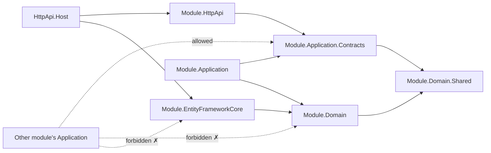

# Solution & Folder Structure

## 1. Repository layout

```
interview-copilot/
├── backend/                          # ABP modular monolith (this design)
├── frontend/                         # Next.js user portal (separate design)
├── docs/
│   ├── architecture/                 # these documents
│   ├── ADR/                          # decision records
│   ├── API/                          # endpoint catalog, OpenAPI exports
│   ├── design/                       # UI references (interview-prep-dashboard.html)
│   └── prompts/                      # prompt template catalog (source of truth: DB)
└── .claude/
    ├── CLAUDE.md                     # project memory for AI-assisted development
    ├── skills/  hooks/  subagents/
```

## 2. Backend solution

```
backend/
├── InterviewCopilot.sln
├── global.json                       # SDK pin: 10.0.x
├── Directory.Build.props             # shared versions, nullable enable, analyzers
├── common.props
├── src/
│   │   # ───────── host & composition root ─────────
│   ├── InterviewCopilot.HttpApi.Host/        # ASP.NET Core host: DI wiring, OpenIddict,
│   │                                         # SignalR hubs, Swagger, admin UI, migrations runner
│   │
│   │   # ───────── shared kernel (kept deliberately small) ─────────
│   ├── InterviewCopilot.Domain.Shared/       # cross-module enums, error codes, consts,
│   │                                         # shared value objects (Score, SkillName)
│   ├── InterviewCopilot.Domain/              # base entity classes (FullAuditedAggregateRoot
│   │                                         # + IMultiTenant + IUserOwnedResource), domain
│   │                                         # primitives; NO business aggregates here
│   ├── InterviewCopilot.Application.Contracts/ # cross-module DTO conventions, permission
│   │                                         # definition names, dashboard contracts
│   ├── InterviewCopilot.Application/         # cross-module app services only
│   │                                         # (DashboardAppService composes module queries)
│   ├── InterviewCopilot.EntityFrameworkCore/ # host DbContext aggregation, migrations,
│   │                                         # Npgsql + pgvector setup, design-time factory
│   ├── InterviewCopilot.HttpApi/             # cross-module controllers (dashboard, health)
│   ├── InterviewCopilot.HttpApi.Client/      # typed client proxies (admin tools, tests)
│   │
│   │   # ───────── business & platform modules ─────────
│   └── modules/
│       ├── identity/                          # thin: ABP Identity + OpenIddict config,
│       │   └── InterviewCopilot.Modules.Identity.*        # profile extensions, OAuth providers
│       ├── resume/
│       │   ├── InterviewCopilot.Modules.Resume.Domain.Shared
│       │   ├── InterviewCopilot.Modules.Resume.Domain
│       │   ├── InterviewCopilot.Modules.Resume.Application.Contracts
│       │   ├── InterviewCopilot.Modules.Resume.Application
│       │   ├── InterviewCopilot.Modules.Resume.EntityFrameworkCore   # "Infrastructure"
│       │   └── InterviewCopilot.Modules.Resume.HttpApi
│       ├── companyresearch/      # same 6-project shape
│       ├── jobdescriptions/      # same
│       ├── interviewpreparation/ # same
│       ├── mockinterview/        # same (+ SignalR hub lives in its HttpApi)
│       ├── ai/                   # same; EF Core project holds usage log + templates
│       └── knowledge/            # same; EF Core project holds pgvector mapping
└── test/
    ├── InterviewCopilot.TestBase/             # ABP test module, FakeAIProvider, builders
    ├── InterviewCopilot.Architecture.Tests/   # ArchUnitNET boundary rules
    ├── modules/
    │   ├── Resume.Domain.Tests / Resume.Application.Tests
    │   ├── ... (one pair per module)
    │   └── Knowledge.Application.Tests        # uses Testcontainers (pgvector)
    └── InterviewCopilot.HttpApi.Host.Tests/   # end-to-end API tests
```

### Why six projects per module (not four)

The brief's "Domain / Application / Infrastructure / Contracts" maps onto ABP's proven naming, plus two pragmatic additions:

| Brief | Project | Notes |
|-------|---------|-------|
| Contracts | `*.Application.Contracts` | DTOs + service interfaces + permission names. **The only project other modules may reference.** |
| Domain | `*.Domain` + `*.Domain.Shared` | `.Shared` carries enums/consts needed by Contracts without exposing entities |
| Application | `*.Application` | Feature folders, command/query app services (ADR-0005) |
| Infrastructure | `*.EntityFrameworkCore` | DbContext, configurations, repositories. ABP-conventional name for the infrastructure layer |
| — | `*.HttpApi` | Module's REST controllers; keeps routing concerns out of Application |

## 3. Project reference rules (CI-enforced)



1. Cross-module: reference `*.Application.Contracts` only. Need data? Call the contract interface or subscribe to the event — never join another module's tables.
2. Business modules → `Modules.AI.Application.Contracts` for all LLM work. No LLM SDK packages anywhere else (NuGet lockdown via Directory.Packages.props + CI check).
3. `Domain.Shared` (root) is the only shared kernel; additions require review (shared-kernel creep is how monoliths rot).
4. Migrations live in the root `EntityFrameworkCore` project (single physical DB, one migration history), but each module owns its EF configurations in its own project — the root project composes them.

## 4. Host composition

`InterviewCopilotHttpApiHostModule` depends on every module's `HttpApi` + `EntityFrameworkCore` modules. Module wiring is ABP `[DependsOn]` graph — adding a module = one line in the host + one EF configuration registration. Feature flags (ABP Features) can dark-launch a module's endpoints.

## 5. Naming conventions

- Namespaces: `InterviewCopilot.Modules.<Module>.<Layer>...`
- DB schemas: `resume`, `company`, `jd`, `prep`, `mock`, `ai`, `knowledge` (+ ABP defaults in `public`)
- Permissions: `InterviewCopilot.<Module>.<Entity>.<Action>` (e.g., `InterviewCopilot.Resume.Resumes.Upload`)
- Events (ETOs): `<Entity><PastTenseVerb>Eto` in `*.Application.Contracts` (e.g., `ResumeParsedEto`)
- Background jobs: `<Verb><Noun>Job` + `<...>JobArgs` record
