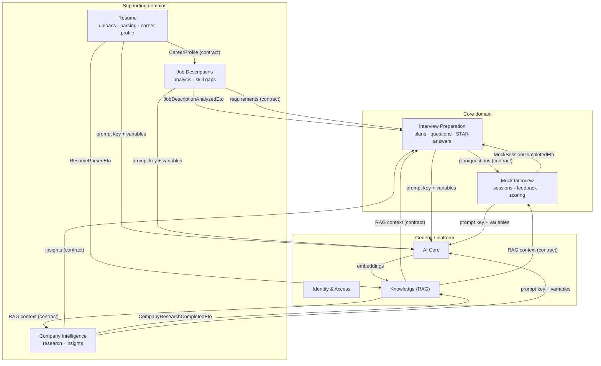

# Bounded Contexts & Module Design

## 1. Context map

Relationship styles: all module-to-module relationships are **customer/supplier via published contracts** (interfaces + DTOs + events). No shared database access, no conformist coupling to another module's internals. Identity is upstream of everything (user ids); AI Core and Knowledge are internal suppliers.

Strategic classification: Preparation and Mock Interview are the **core domain** (the product's differentiating value). Resume/JD/Company Intelligence are **supporting** (feed the core with structured context). Identity, AI Core, Knowledge are **generic/platform** capabilities.

## 2. Module catalog

### 2.1 Identity & Access (`Modules.Identity`)

Thin wrapper over ABP Identity + OpenIddict. Owns nothing domain-specific beyond profile extension properties.

| Aspect | Design |
|--------|--------|
| Responsibilities | Authentication (JWT + refresh), authorization (roles/permissions), user profiles, OAuth providers (Google now; Microsoft, LinkedIn later) |
| Entities | ABP `IdentityUser` (+ extension properties: DisplayName, TimeZone, TargetRole, OnboardingState), `IdentityRole`, OpenIddict applications/tokens |
| Publishes | ABP built-in user events (`UserCreatedEto` etc.) |
| Depends on | — |
| Notes | See [07-security.md](07-security.md). Roles: `admin`, `user`. Everything else is permission-based. |

### 2.2 Resume (`Modules.Resume`)

| Aspect | Design |
|--------|--------|
| Responsibilities | Resume upload (PDF/DOCX), versioning, AI parsing, skill & experience extraction, consolidated career profile |
| Aggregates | `Resume` (root; child `ResumeVersion` → parse results `ResumeSkill`, `ResumeExperience`, `ResumeEducation`), `CareerProfile` (root; one per user) |
| Key flows | Upload → blob save → version row → `ResumeParsingJob` → structured extraction via AI Core → parse children written → `ResumeParsedEto` → career profile merge + knowledge ingestion |
| Publishes | `ResumeVersionCreatedEto`, `ResumeParsedEto`, `ResumeParsingFailedEto`, `CareerProfileUpdatedEto` |
| Subscribes | — |
| Exposes (contracts) | `IResumeAppService`, `ICareerProfileAppService`, `ICareerProfileLookupService` (for JD module's gap analysis) |
| Policies | Max versions per resume (10), max file size (10 MB), allowed mime types; parse is idempotent per version |

### 2.3 Job Descriptions (`Modules.JobDescriptions`)

| Aspect | Design |
|--------|--------|
| Responsibilities | JD upload (text/file/URL), AI analysis into structured requirements, skill-gap analysis vs career profile |
| Aggregates | `JobDescription` (root; child `JobRequirement`), `SkillGapAnalysis` (root; child `SkillGap`) |
| Key flows | Create → `JdAnalysisJob` → requirements extracted → `JobDescriptionAnalyzedEto`. Skill gap: command pulls `CareerProfileSnapshot` via Resume contract, AI Core compares, persists analysis with **snapshots** of both sides (analyses stay stable when profile changes later) |
| Publishes | `JobDescriptionAnalyzedEto`, `SkillGapAnalyzedEto` |
| Subscribes | — |
| Exposes | `IJobDescriptionAppService`, `ISkillGapAppService`, `IJobRequirementLookupService` (for Prep) |

### 2.4 Company Intelligence (`Modules.CompanyResearch`)

| Aspect | Design |
|--------|--------|
| Responsibilities | Canonical company registry, AI research runs, insights (culture, hiring process, interview style, recent news), refresh/staleness policy |
| Aggregates | `Company` (root; host-level shared reference data), `CompanyResearch` (root; per user request; child `CompanyInsight`) |
| Key flows | Request research → dedup check (fresh research < 30 days for same company reused, copied to user) → `CompanyResearchJob` (AI + optional web sources) → insights persisted → `CompanyResearchCompletedEto` → knowledge ingestion |
| Publishes | `CompanyResearchCompletedEto`, `CompanyResearchFailedEto` |
| Subscribes | — |
| Exposes | `ICompanyAppService`, `ICompanyResearchAppService`, `ICompanyInsightLookupService` (for Prep) |
| Notes | `Company` rows have `TenantId = null` (shared); user-specific research carries `UserId` |

### 2.5 Interview Preparation (`Modules.InterviewPreparation`)

| Aspect | Design |
|--------|--------|
| Responsibilities | Question generation, STAR answer generation/editing, preparation plans with scheduled items, tips, study-activity + readiness tracking (drives the dashboard) |
| Aggregates | `InterviewPlan` (root; child `InterviewPlanItem`), `InterviewQuestion` (root; child `StarAnswer` — versioned drafts), `InterviewTip` (root, lightweight), `StudyActivity` (append-only log), `ReadinessSnapshot` (computed, per user) |
| Key flows | Generate plan (`PlanGenerationJob`: JD requirements + gaps + company insights + RAG context → day-by-day items). Generate questions in batches by category/difficulty. STAR answers generated per question from career-profile experiences (RAG), user-editable, versioned |
| Publishes | `PlanGeneratedEto`, `PlanItemCompletedEto`, `StarAnswerDraftedEto` |
| Subscribes | `JobDescriptionAnalyzedEto` (suggest plan), `MockSessionCompletedEto` (log activity, update readiness, adapt plan) |
| Exposes | `IInterviewPlanAppService`, `IInterviewQuestionAppService`, `IStarAnswerAppService`, `IPreparationProgressAppService` (dashboard contract) |

### 2.6 Mock Interview (`Modules.MockInterview`)

| Aspect | Design |
|--------|--------|
| Responsibilities | Live AI interview sessions (text streaming v1), turn management, per-answer feedback, session scoring, history |
| Aggregates | `InterviewSession` (root; children `InterviewTurn`, `InterviewFeedback`) |
| Key flows | Start (mode, persona, source: plan/JD/ad-hoc) → hub conversation: AI question streamed → user answer → turn persisted → optional instant per-turn feedback → complete → `FeedbackGenerationJob` writes structured feedback + rubric scores → `MockSessionCompletedEto` |
| State machine | `Created → InProgress → Completed \| Abandoned` (auto-abandon after 24 h inactivity) |
| Publishes | `MockSessionCompletedEto` |
| Subscribes | — |
| Exposes | `IMockInterviewAppService`, `IMockSessionHistoryAppService`; SignalR hub `/hubs/mock-interview` |
| Notes | `SessionMode` enum (`Text`, future `Voice`) — transport-agnostic turn model so voice adds a transport, not a schema change |

### 2.7 AI Core (`Modules.AI`)

| Aspect | Design |
|--------|--------|
| Responsibilities | Provider abstraction (strategy), routing & fallback, prompt template registry (versioned, DB-backed), usage/cost tracking, rate limiting, circuit breaking |
| Aggregates | `PromptTemplate` (root; versioned), `AIProviderConfig` (root), `AIUsageLog` (append-only) |
| Exposes (to modules) | `IAIChatCompletion`, `IAIStructuredExtraction`, `IAIEmbeddingService` |
| Internal | `IAIProvider` (strategy: `ClaudeProvider`, `OpenAIProvider`, `GeminiProvider`), `IAIRouter`, `IPromptRenderer` |
| Admin surface | CRUD prompt templates, provider config, usage dashboards |
| Details | [05-ai-architecture.md](05-ai-architecture.md) |

### 2.8 Knowledge (`Modules.Knowledge`)

| Aspect | Design |
|--------|--------|
| Responsibilities | Document registry for RAG sources, chunking, embedding generation, semantic search, RAG context assembly |
| Aggregates | `KnowledgeDocument` (root; child `DocumentChunk` with `vector(1536)` embedding), `SearchIndexConfig` (embedding model + dimensions + metric per index generation) |
| Key flows | Subscribes to source events → `EmbeddingGenerationJob` (chunk → embed via AI Core → upsert). Query: `IRagContextProvider.GetContextAsync(userId, purpose, query, topK)` → filtered ANN search → ranked context block |
| Publishes | `DocumentIndexedEto` |
| Subscribes | `ResumeParsedEto`, `JobDescriptionAnalyzedEto`, `CompanyResearchCompletedEto` |
| Exposes | `IKnowledgeDocumentAppService` (user uploads, e.g. own notes), `ISemanticSearchAppService`, `IRagContextProvider` |
| Notes | Re-index strategy: `SearchIndexConfig` version stamps chunks; model upgrades trigger background re-embed; deletes cascade by source id (GDPR) |

## 3. Cross-module communication summary

| From | To | Mechanism | Payload |
|------|----|-----------|---------|
| Resume | Knowledge | Event (async) | `ResumeParsedEto { ResumeId, VersionId, UserId }` |
| Resume | JD | Contract (sync) | `ICareerProfileLookupService.GetSnapshotAsync(userId)` |
| JD | Prep | Event + contract | `JobDescriptionAnalyzedEto`; `IJobRequirementLookupService` |
| Company | Prep | Contract (sync) | `ICompanyInsightLookupService.GetInsightsAsync(companyId)` |
| Prep | Mock | Contract (sync) | question set / plan context for session bootstrap |
| Mock | Prep | Event (async) | `MockSessionCompletedEto { SessionId, UserId, Scores }` |
| Any business | AI Core | Contract (sync) | prompt key + variables + options |
| Knowledge | AI Core | Contract (sync) | embedding requests |

Events carry **ids + minimal facts**, not entity bodies; consumers fetch what they need through contracts. All events are ABP local distributed events inside one process today; the same ETOs move to a broker untouched if a module is ever extracted.

## 4. Consistency boundaries

- Within an aggregate: strict (one transaction).
- Within a module across aggregates: one ABP unit of work per command (still one DB transaction).
- Across modules: **eventual** via events + jobs. UI surfaces job status (`ParseStatus`, `ResearchStatus`, `AnalysisStatus`) rather than pretending synchrony.
