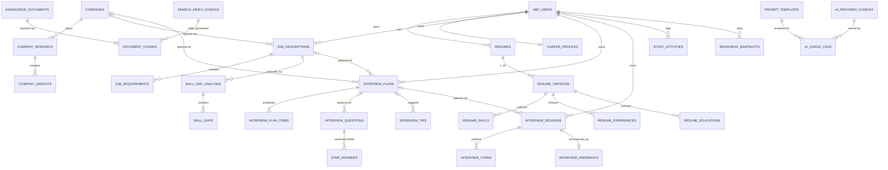

# Database Design

Single PostgreSQL 17 database `interview_copilot`, extension `vector` (pgvector). One schema per module; ABP framework tables (AbpUsers, AbpRoles, AbpPermissionGrants, AbpSettings, AbpAuditLogs, AbpBackgroundJobs, AbpFeatures, AbpTenants, OpenIddict*) stay in `public`.

Column conventions (every app table unless noted): `id uuid PK` (GUIDv7), `tenant_id uuid NULL`, ABP full audit columns (`creation_time`, `creator_id`, `last_modification_time`, `last_modifier_id`, `is_deleted`, `deleter_id`, `deletion_time`), soft delete with partial indexes `WHERE is_deleted = false`. Naming: snake_case (Npgsql convention).

## 1. ERD

Cross-schema lines (e.g., `JOB_DESCRIPTIONS → COMPANIES`) are **soft references**: a uuid column + application-level integrity, no physical FK across module schemas. Physical FKs exist only inside a module schema (root → children, `ON DELETE CASCADE`). This is what keeps modules extractable.

## 2. Tables by schema

### Schema `resume`

| Table | Columns (beyond conventions) | Notes |
|---|---|---|
| `resumes` | `user_id uuid`, `title varchar(200)`, `status smallint` (Draft/Active/Archived), `current_version_no int` | idx: `(user_id) WHERE NOT is_deleted` |
| `resume_versions` | `resume_id uuid FK→resumes CASCADE`, `version_no int`, `blob_name varchar(256)`, `mime_type varchar(100)`, `file_size int`, `raw_text text`, `parse_status smallint` (Pending/Processing/Completed/Failed), `parse_error varchar(1000)`, `parsed_at timestamptz` | unique `(resume_id, version_no)` |
| `resume_skills` | `resume_version_id uuid FK CASCADE`, `name varchar(100)`, `normalized_name varchar(100)`, `category varchar(50)`, `proficiency smallint`, `years numeric(4,1)` | idx `(resume_version_id)`, idx `(normalized_name)` |
| `resume_experiences` | `resume_version_id uuid FK CASCADE`, `company varchar(200)`, `title varchar(200)`, `start_date date`, `end_date date NULL`, `description text`, `highlights jsonb` | |
| `resume_educations` | `resume_version_id uuid FK CASCADE`, `institution varchar(200)`, `degree varchar(200)`, `field varchar(200)`, `start_date date`, `end_date date NULL` | |
| `career_profiles` | `user_id uuid UNIQUE`, `headline varchar(200)`, `summary text`, `total_years numeric(4,1)`, `skills jsonb` (array of {name, level, years, pinned}), `last_merged_version_id uuid NULL`, `user_edited_at timestamptz NULL` | jsonb GIN idx on `skills` |

### Schema `jd`

| Table | Columns | Notes |
|---|---|---|
| `job_descriptions` | `user_id`, `company_id uuid NULL` (soft ref), `title varchar(200)`, `company_name_raw varchar(200)`, `raw_text text`, `blob_name varchar(256) NULL`, `source_url varchar(2000) NULL`, `seniority smallint`, `employment_type smallint`, `location varchar(200)`, `analysis_status smallint`, `analyzed_at timestamptz` | idx `(user_id)` |
| `job_requirements` | `job_description_id FK CASCADE`, `type smallint` (MustHave/NiceToHave/Responsibility/Qualification), `skill_name varchar(100) NULL`, `normalized_skill varchar(100) NULL`, `description varchar(2000)`, `importance smallint` | idx `(job_description_id)` |
| `skill_gap_analyses` | `user_id`, `job_description_id` (soft ref within schema: physical FK ok — same module), `resume_id uuid NULL` (soft ref), `profile_snapshot jsonb`, `match_score smallint`, `summary text` | immutable rows |
| `skill_gaps` | `analysis_id FK CASCADE`, `skill_name varchar(100)`, `required_level smallint`, `current_level smallint`, `severity smallint`, `recommendation varchar(2000)` | |

### Schema `company`

| Table | Columns | Notes |
|---|---|---|
| `companies` | `name varchar(200)`, `normalized_name varchar(200) UNIQUE`, `website varchar(500)`, `industry varchar(100)`, `size_range varchar(50)`, `hq_location varchar(200)`, `logo_url varchar(500)` | `tenant_id` always NULL (shared); no `user_id` |
| `company_research` | `user_id`, `company_id FK→companies`, `status smallint`, `requested_at`, `completed_at`, `summary text`, `model_used varchar(100)` | partial unique `(user_id, company_id) WHERE status IN (Pending,Processing)` |
| `company_insights` | `research_id FK CASCADE`, `type smallint` (Culture/HiringProcess/InterviewStyle/News/Values/Compensation), `title varchar(300)`, `content text`, `sources jsonb`, `confidence smallint` | idx `(research_id, type)` |

### Schema `prep`

| Table | Columns | Notes |
|---|---|---|
| `interview_plans` | `user_id`, `job_description_id uuid NULL`, `company_id uuid NULL`, `title varchar(200)`, `target_date date`, `status smallint` (Active/Completed/Archived), `generation_status smallint` | partial unique `(user_id, job_description_id) WHERE status = Active` |
| `interview_plan_items` | `plan_id FK CASCADE`, `order_no int`, `scheduled_date date`, `track smallint` (Behavioral/SystemDesign/Coding/CompanyFit/Review), `title varchar(300)`, `description text`, `duration_min int`, `status smallint` (Todo/InProgress/Done/Skipped), `completed_at timestamptz` | idx `(plan_id, scheduled_date)` |
| `interview_questions` | `user_id`, `plan_id uuid NULL`, `job_description_id uuid NULL`, `category smallint`, `difficulty smallint`, `question_text text`, `rationale text`, `source smallint` (Generated/Curated/UserAdded) | idx `(user_id, category)` |
| `star_answers` | `question_id FK CASCADE`, `version_no int`, `situation text`, `task text`, `action text`, `result text`, `full_text text`, `is_user_edited bool`, `is_current bool` | unique `(question_id, version_no)`; partial unique `(question_id) WHERE is_current` |
| `interview_tips` | `user_id`, `plan_id uuid NULL`, `category smallint`, `content varchar(2000)` | |
| `study_activities` | `user_id`, `activity_date date`, `source smallint` (PlanItem/MockSession/QuestionPractice/NoteReview), `source_id uuid`, `minutes int`, `items_completed int` | idx `(user_id, activity_date)` — feeds streak + study time |
| `readiness_snapshots` | `user_id`, `snapshot_date date`, `overall smallint`, `by_track jsonb`, `inputs jsonb` (explainability) | unique `(user_id, snapshot_date)` — feeds readiness ring + delta |

### Schema `mock`

| Table | Columns | Notes |
|---|---|---|
| `interview_sessions` | `user_id`, `plan_id uuid NULL`, `job_description_id uuid NULL`, `mode smallint` (Text=1; Voice reserved), `persona jsonb`, `status smallint`, `started_at`, `completed_at`, `total_turns int`, `overall_score smallint NULL` | idx `(user_id, status)` |
| `interview_turns` | `session_id FK CASCADE`, `order_no int`, `question_text text`, `question_category smallint`, `answer_text text`, `answered_at timestamptz`, `turn_score smallint NULL`, `turn_feedback jsonb NULL` | unique `(session_id, order_no)` |
| `interview_feedbacks` | `session_id FK UNIQUE`, `overall_score smallint`, `rubric jsonb` ({communication, structure, technical_depth, relevance, confidence}), `strengths jsonb`, `improvements jsonb`, `recommendation text`, `model_used varchar(100)` | 1:1 with session |

### Schema `knowledge`

| Table | Columns | Notes |
|---|---|---|
| `knowledge_documents` | `user_id uuid NULL` (NULL = shared corpus), `source_type smallint` (Resume/JobDescription/CompanyResearch/UserNote/Upload), `source_id uuid`, `title varchar(300)`, `status smallint` (Pending/Indexed/Failed/Stale), `index_config_id uuid`, `chunk_count int` | unique `(source_type, source_id, index_config_id)` |
| `document_chunks` | `document_id FK CASCADE`, `chunk_index int`, `text text`, `token_count int`, `metadata jsonb`, `embedding vector(1536)` | `CREATE INDEX ON document_chunks USING hnsw (embedding vector_cosine_ops)`; btree `(document_id)`; metadata GIN |
| `search_index_configs` | `name varchar(100)`, `embedding_model varchar(100)`, `dimensions int`, `distance smallint`, `is_active bool` | re-index generations |

Query pattern (always filtered before ANN): `WHERE user_id = @uid AND source_type = ANY(@types) ORDER BY embedding <=> @query LIMIT @k` — join `knowledge_documents` for the filter, HNSW handles the rest.

### Schema `ai`

| Table | Columns | Notes |
|---|---|---|
| `prompt_templates` | `key varchar(100)`, `version int`, `body text`, `variables jsonb` (declared names + required flags), `model_hints jsonb` (preferred provider/model/temperature/max_tokens), `is_active bool`, `notes varchar(1000)` | unique `(key, version)`; partial unique `(key) WHERE is_active` |
| `ai_provider_configs` | `name varchar(50)` (claude/openai/gemini), `enabled bool`, `priority int`, `models jsonb` (per-capability model names), `secret_ref varchar(200)`, `rate_limit jsonb`, `timeout_ms int` | unique `(name)` |
| `ai_usage_logs` | `user_id uuid NULL`, `feature varchar(100)` (prompt key), `module varchar(50)`, `provider varchar(50)`, `model varchar(100)`, `input_tokens int`, `output_tokens int`, `cached_tokens int`, `cost numeric(10,6)`, `latency_ms int`, `status smallint` (Success/Failed/Timeout/RateLimited/Fallback), `error_code varchar(100)`, `correlation_id uuid`, `session_id uuid NULL` | idx `(user_id, creation_time)`, `(feature, creation_time)`. Monthly range partitions from phase 4; daily rollup table `ai_usage_daily` for dashboards |

## 3. Integrity & lifecycle policies

| Concern | Policy |
|---|---|
| Cross-schema refs | Soft uuid refs; validated in application services; orphan tolerance (e.g., deleted JD leaves plan readable with `job_description_id` dangling — UI shows "source removed") |
| User deletion (GDPR) | `UserDataEraser` orchestrator: per-module erasers cascade by `user_id`; knowledge chunks deleted by document `user_id`; blobs deleted by stored names; AI usage logs anonymized (user_id nulled), not deleted (billing audit) |
| Blob storage | ABP BLOB storing, container per type (`resumes`, `jds`); DB stores `blob_name` only. Provider: file system in dev, S3-compatible in prod (config swap) |
| Concurrency | ABP optimistic concurrency (`concurrency_stamp`) on roots users edit (CareerProfile, StarAnswer via parent, PlanItem status) |
| Migrations | Single EF migration history (host EF project composes module configurations); pgvector extension + HNSW indexes created via raw SQL in migrations |
| Hot reads | Dashboard summary served from `readiness_snapshots` + `study_activities` aggregates + counts — no heavy joins at request time; rollups maintained by handlers and a nightly job |

## 4. Sizing assumptions (v1 targets)

10k MAU: resumes ~30k rows, versions ~60k, chunks ~3–5M rows (≈ 6 KB/vector → 20–30 GB table incl. index — fine on a single node), usage logs ~5–10M rows/yr (partitioned). All comfortably within single-instance PostgreSQL.
