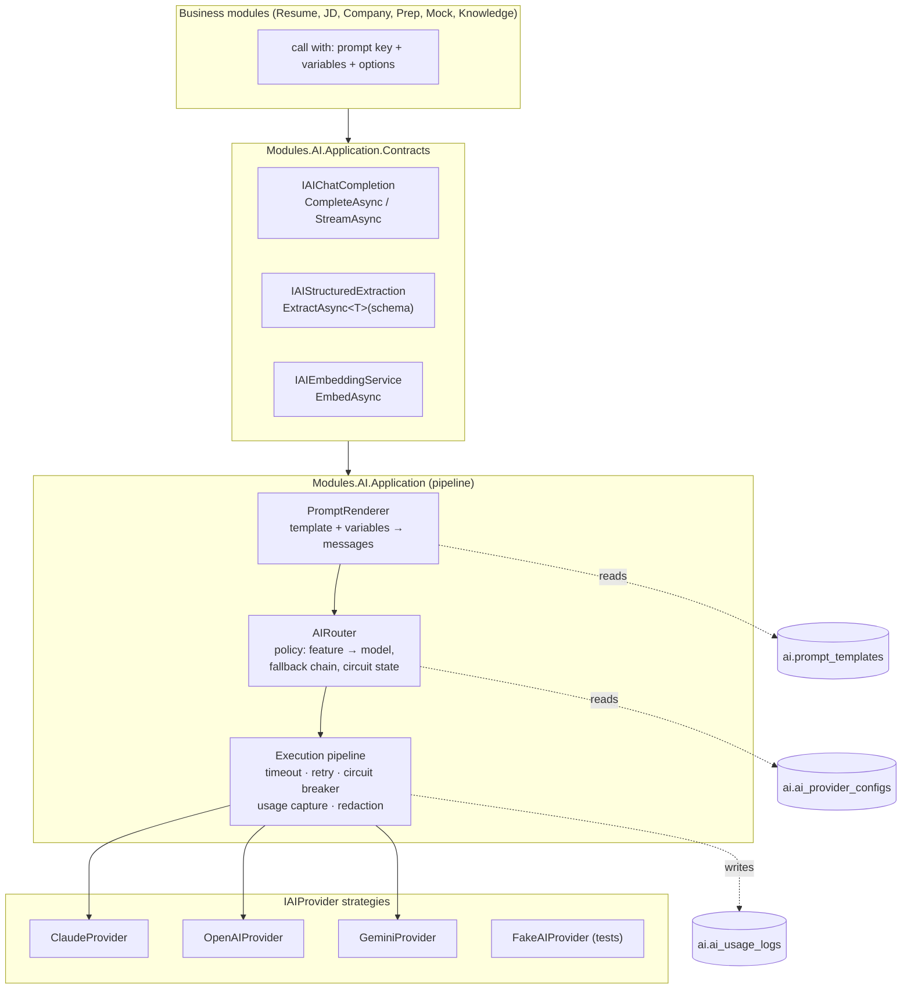

# AI Architecture (AI Core module)

Design goal: every LLM interaction in the product goes through one narrow, observable, swappable pipe. Business modules know prompt **keys** and typed results — never providers, SDKs, or prompt strings.

## 1. Layering

## 2. Contracts (shape, not code)

| Interface | Operations | Notes |
|---|---|---|
| `IAIChatCompletion` | `CompleteAsync(AIRequest) → AIResult`; `StreamAsync(AIRequest) → IAsyncEnumerable<AIChunk>` | `AIRequest = { PromptKey, Variables, ConversationHistory?, Options (temperature, maxTokens, jsonMode), Attribution (userId, module, feature, correlationId) }` |
| `IAIStructuredExtraction` | `ExtractAsync<T>(promptKey, variables, attribution)` | JSON-schema derived from `T`; validates + one repair retry on invalid JSON; used by resume/JD parsing |
| `IAIEmbeddingService` | `EmbedAsync(texts[], purpose) → float[][]` | Purpose maps to model via active `SearchIndexConfig` |
| `IAIProvider` (internal strategy) | `CompleteAsync`, `StreamAsync`, `EmbedAsync?`, `Capabilities { Streaming, JsonMode, Embeddings, MaxContext, Models[] }` | One implementation per vendor; adapters may use vendor SDKs or `Microsoft.Extensions.AI` internally (ADR-0004) |
| `IAIRouter` (internal) | `Resolve(request) → (provider, model)` + fallback chain | Inputs: template `model_hints`, provider configs (enabled, priority), circuit-breaker state, capability requirements (streaming/json) |

## 3. Execution pipeline (every call)

1. **Render** — load active `PromptTemplate` by key; validate supplied variables against declared ones; render system/user messages. Missing template/variable = hard error (no silent defaults).
2. **Route** — pick provider+model: template hint → feature policy → provider priority. Capability check (e.g., mock interview requires streaming).
3. **Guard** — per-user and per-feature rate/quota check (ABP Features: daily AI calls, monthly tokens — free vs paid plans); input redaction hook (strip emails/phones where the feature doesn't need them).
4. **Execute** — timeout per template hint (default 60 s, jobs 120 s); retries: 1 retry on transient (429/5xx, exponential backoff), then **fallback** to next provider in chain (only if template marked `fallback_allowed` — extraction yes, mock-interview persona continuity no).
5. **Record** — `AIUsageLog` row always (success or failure): tokens from provider response, computed cost from a price table in provider config, latency, status, correlation id. Streaming: usage written on stream completion/abort.
6. **Circuit breaker** — consecutive-failure threshold opens circuit per provider for cool-down; router skips open circuits; admin sees circuit state.

## 4. Prompt template registry

- DB-backed (`ai.prompt_templates`), versioned, admin-editable; exactly one active version per key; published versions immutable — changes create a new version (auditable, instant rollback).
- `docs/prompts/prompt-catalog.md` documents keys + intent; DB is runtime truth; templates seeded via data-seed contributors.
- Keys (initial set): `resume.parse`, `resume.profile-merge`, `jd.analyze`, `jd.skill-gap`, `company.research`, `company.summarize`, `prep.plan.generate`, `prep.questions.generate`, `prep.star.generate`, `prep.tips.generate`, `mock.interviewer.system`, `mock.turn.feedback`, `mock.session.feedback`, `knowledge.summarize`, `dashboard.daily-focus`.
- Variables declared in template metadata; renderer rejects undeclared/missing variables — prevents prompt drift from code changes.

## 5. Provider routing policy (initial)

| Feature class | Primary | Fallback | Rationale |
|---|---|---|---|
| Structured extraction (resume/JD) | Claude (json mode) | OpenAI → Gemini | Accuracy on long documents |
| Long-form generation (plans, STAR, research) | Claude | OpenAI | Quality; cost acceptable at volume |
| Conversational interviewer (streaming) | Claude | none (graceful degrade: "interviewer unavailable") | Persona continuity > availability fallback |
| Per-turn quick feedback | Gemini (flash-class) or OpenAI mini-class | other | Latency + cost; quality bar lower |
| Embeddings | OpenAI text-embedding (1536-d) | none (re-queue) | Index consistency requires one model per index generation |

All of this is **configuration**, not code — admin can re-route per feature without deploy.

## 6. RAG design (Knowledge module, consumes AI Core)

**Ingestion:** source event → load source text (parsed resume, JD, research) → `Chunker` (structure-aware: section-based for resumes/JDs, ~400–600 token chunks, 10–15% overlap) → `EmbedAsync` batch → upsert `document_chunks` in one tx → document `Indexed`.

**Retrieval:** `IRagContextProvider.GetContextAsync(userId, purpose, query, topK=8)`:
1. Build filter from purpose (e.g., STAR generation → user's resume + JD chunks; mock interview → + company insights).
2. Embed query → ANN search (cosine, HNSW) with SQL metadata filter.
3. Similarity floor (cosine ≥ 0.25 after normalization) + simple recency boost; dedupe by document.
4. Return ordered `ChunkRef[]` + assembled context block with source labels (prompts cite sources → answers can show "based on your resume").

No agent framework in v1: retrieval is deterministic, single-hop. If multi-hop/tool-use emerges later, it lands inside AI Core behind the same contracts.

## 7. Streaming path (mock interview)

`SessionConductor` (Mock domain service) → `IAIChatCompletion.StreamAsync` → `IAsyncEnumerable<AIChunk>` → SignalR hub forwards chunks to the client group → on completion: turn persisted, usage logged. Cancellation (user disconnect/skip) propagates via `CancellationToken` to the provider call; partial output usage still recorded. Backpressure: hub buffers ≤ 1 outstanding chunk batch per connection (drop-oldest is unacceptable for text → apply flow control, slow client just delays its own stream).

## 8. Cost & usage management

- `ai_usage_logs` is the meter; `ai_usage_daily` rollup powers admin dashboards (per feature/provider/user) and quota checks (cheap reads).
- Plan limits via ABP Features: e.g., Free = 1 active plan, 3 mock sessions/mo, 50k tokens/day; Pro = higher. Enforced in guard step (step 3) with friendly domain errors (`AiQuotaExceededException` → 429 + upgrade hint).
- Prompt-level `max_tokens` caps; long inputs truncated by context-budget policy (keep system + last N turns + RAG top-k within model context).

## 9. Failure modes & degradation

| Failure | Behavior |
|---|---|
| Provider 429/5xx | Retry once → fallback chain (if allowed) → job: scheduled retry with backoff (max 3); interactive: typed error to client |
| Invalid JSON from extraction | One schema-guided repair attempt → mark `parse_status = Failed` with reason; user can retry |
| All providers down | Circuit open → feature-level "AI temporarily unavailable" status; CRUD unaffected |
| Embedding outage | Documents stay `Pending`; ingestion queue drains on recovery; search falls back to recency-ordered keyword `ILIKE` (degraded, labeled) |
| Runaway cost | Daily global budget breaker (admin setting) → non-interactive jobs paused first, interactive features last |
