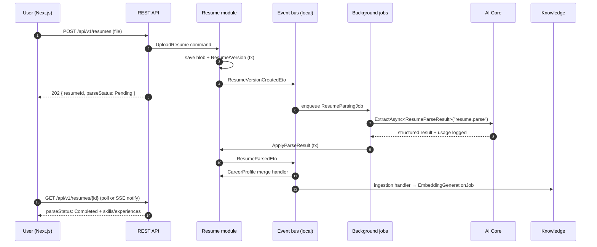

# Integration Design — Events, Background Jobs, Realtime

## 1. Internal event flows

The same shape (command → event → job → AI → apply → event) repeats for JD analysis, company research, plan generation, and session feedback. One pattern, learned once.

## 2. Event catalog

| Event (ETO) | Publisher | Subscribers → effect |
|---|---|---|
| `ResumeVersionCreatedEto` | Resume | Resume → enqueue `ResumeParsingJob` |
| `ResumeParsedEto` | Resume | Resume → merge `CareerProfile`; Knowledge → enqueue `EmbeddingGenerationJob` |
| `ResumeParsingFailedEto` | Resume | Notification handler → user notice |
| `CareerProfileUpdatedEto` | Resume | JD → mark dependent skill-gap analyses `Stale` (advisory flag) |
| `JobDescriptionAnalyzedEto` | JD | Prep → suggest plan creation (notification); Knowledge → ingest JD chunks |
| `SkillGapAnalyzedEto` | JD | Prep → enrich active plan suggestions |
| `CompanyResearchCompletedEto` | Company | Knowledge → ingest insights; Notification → user notice |
| `CompanyResearchFailedEto` | Company | Notification handler → user notice |
| `PlanGeneratedEto` | Prep | Notification → user notice |
| `PlanItemCompletedEto` | Prep | Prep → `StudyActivity` append + readiness recompute (debounced) |
| `StarAnswerDraftedEto` | Prep | (observability; future notification when drafted via job) |
| `MockSessionCompletedEto` | Mock | Mock → enqueue `FeedbackGenerationJob`; Prep → `StudyActivity` append + readiness recompute |
| `DocumentIndexedEto` | Knowledge | (observability; future notification) |

Rules: ETOs live in publisher's `Application.Contracts`; payload = ids + minimal facts; handlers idempotent (natural keys / status checks); handler failures don't roll back the publisher (ABP local bus runs in-process — handlers that enqueue jobs are tiny and safe; heavy work always goes to jobs).

## 3. Background jobs (ABP Background Jobs, DB-backed queue)

| Job | Args | Trigger | Idempotency / retry |
|---|---|---|---|
| `ResumeParsingJob` | `{ ResumeId, VersionId }` | `ResumeVersionCreatedEto` | Skip if version not `Pending`; 3 retries backoff; terminal → `Failed` + event |
| `JdAnalysisJob` | `{ JobDescriptionId }` | JD created/re-analyze command | Status-gated; replaces requirements atomically |
| `CompanyResearchJob` | `{ ResearchId }` | research requested | Status-gated; reuses fresh research (< 30 d) by copy |
| `PlanGenerationJob` | `{ PlanId }` | plan generate command | Plan `generation_status` gate; regenerates only while `Pending` |
| `EmbeddingGenerationJob` | `{ DocumentId }` | source-indexed events / re-index | Chunk-set swap in one tx; safe to re-run |
| `FeedbackGenerationJob` | `{ SessionId }` | `MockSessionCompletedEto` | Skip if feedback exists; per-turn scores filled if missing |
| `AISummaryJob` (daily-focus) | `{ UserId, Date }` | nightly batch (recurring) | Upsert per (user, date); also computes `ReadinessSnapshot` + `ai_usage_daily` rollup |
| `SessionJanitorJob` | — | recurring (hourly) | Abandons `InProgress` sessions idle > 24 h |
| `UsageRollupJob` | `{ Date }` | recurring (nightly) | Idempotent upsert into `ai_usage_daily` |

Job conventions: args are records with ids only; jobs load state fresh (no payloads of stale data); every job logs start/end with correlation id; max concurrency configured per job type (AI-heavy jobs throttled to protect rate limits — e.g., 4 concurrent embedding jobs). ABP's default job store is fine at v1 volume; swap to Hangfire via ABP integration if sustained > ~10 jobs/s (revisit trigger, ADR-0001).

Recurring jobs use ABP `BackgroundWorkers` (timer-based) — `SessionJanitorJob`, `UsageRollupJob`, nightly `AISummaryJob` batch.

## 4. Realtime — SignalR

**Hub:** `/hubs/mock-interview` (JWT auth, user-scoped groups).

| Direction | Message | Payload |
|---|---|---|
| client → server | `StartSession` | `{ planId?, jobDescriptionId?, persona, questionCount }` |
| server → client | `SessionStarted` | `{ sessionId, firstQuestionStreamFollows }` |
| server → client | `QuestionChunk` | `{ sessionId, turnNo, delta }` (token stream) |
| server → client | `QuestionCompleted` | `{ sessionId, turnNo, fullText }` |
| client → server | `SubmitAnswer` | `{ sessionId, turnNo, answerText }` |
| server → client | `TurnFeedback` (optional, per settings) | `{ turnNo, score, notes }` |
| client → server | `CompleteSession` / `AbandonSession` | `{ sessionId }` |
| server → client | `SessionCompleted` | `{ sessionId, feedbackStatus: Generating }` |
| server → client | `Error` | `{ code, message, retryable }` |

Reconnection: client resumes by `sessionId`; server replays last completed turn state (turns are persisted per append, so a dropped connection loses at most the in-flight stream, which is re-streamed). Voice later = new message types on the same session model.

**Job-status notifications** (parse/analysis/research/plan): v1 uses polling on status fields (simple, cacheable). A general `/hubs/notifications` hub is a phase-6 enhancement — endpoints already return status objects, so the UI contract doesn't change.

## 5. External integrations

| Integration | Module | Notes |
|---|---|---|
| Claude / OpenAI / Gemini APIs | AI Core only | Keys via secret refs (env/key vault), never DB plaintext; egress allowlist |
| Google OAuth | Identity | External login provider on OpenIddict (see 07-security.md); Microsoft/LinkedIn later — additive provider registrations |
| Blob storage (S3-compatible) | Resume, JD | Via ABP BLOB storing abstraction; presigned download URLs through API, never public buckets |
| Company data web sources | Company Intelligence | v1: AI-knowledge + user-provided links recorded as `SourceAttribution`; structured crawling/search API is a deliberate later add (cost + legal review) |
| Email (transactional) | Host | ABP `IEmailSender`; verification, password reset, weekly digest (phase 6) |

## 6. Observability

- **Correlation:** one `correlationId` flows request → events → jobs → AI usage logs (ABP correlation id provider).
- **Tracing/metrics:** OpenTelemetry (ASP.NET Core + Npgsql + custom AI spans: provider, model, tokens, first-token latency). Exporter pluggable (OTLP).
- **Health:** `/health/live` (process), `/health/ready` (DB, blob, one cheap provider ping cached 60 s).
- **Audit:** ABP audit logging on all app service calls (admin-visible).
